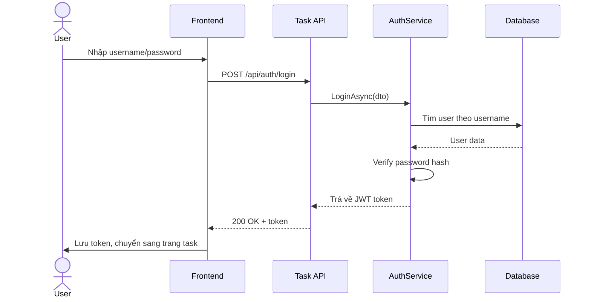
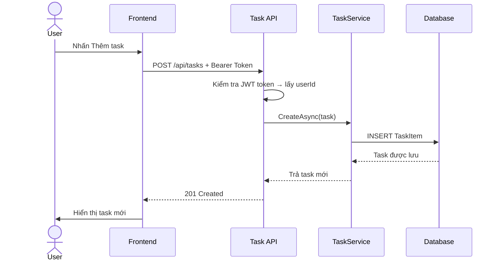
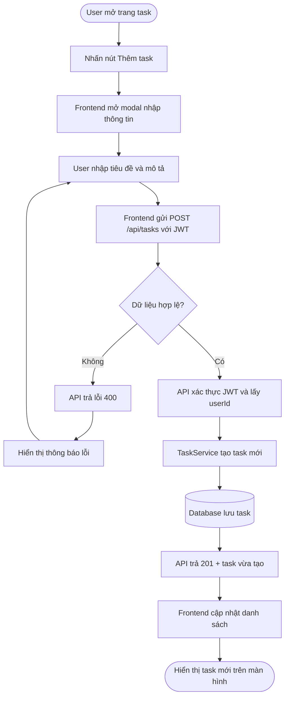
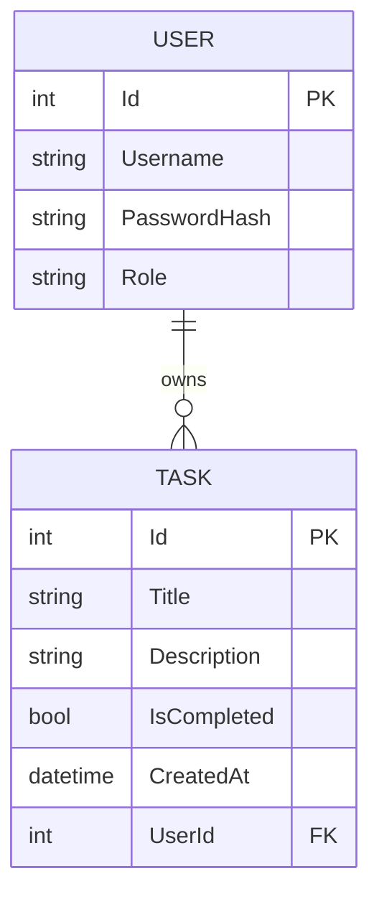
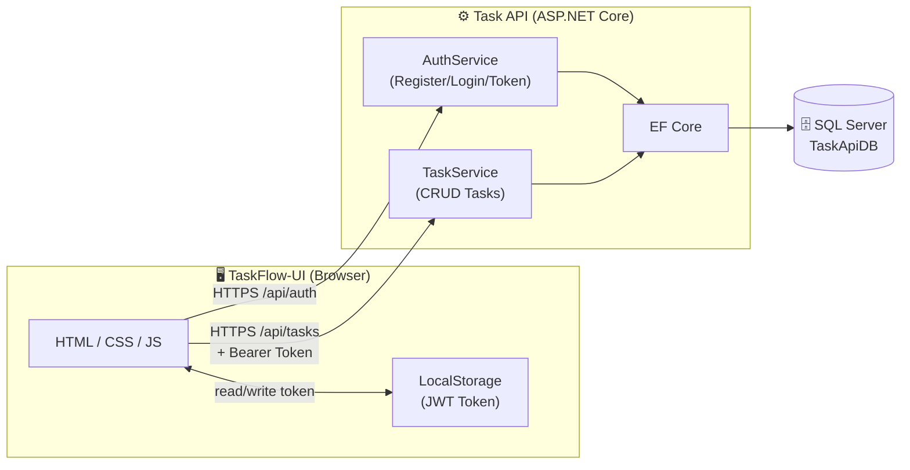

# TaskFlow 🚀

> Full-Stack Task Management App — ASP.NET Core Web API + HTML/CSS/JS


---

## 📌 Giới thiệu

TaskFlow là ứng dụng quản lý công việc cá nhân, được xây dựng với kiến trúc Full-Stack:
- **Backend:** ASP.NET Core Web API (.NET 9) + Entity Framework Core + SQL Server
- **Frontend:** HTML / CSS / JavaScript thuần — kết nối API thật

---

## ✨ Tính năng

| Tính năng | Mô tả |
|-----------|-------|
| 🔐 Đăng ký / Đăng nhập | JWT Authentication, hash password SHA256 |
| 📋 Quản lý task | Tạo, sửa, xóa, đánh dấu hoàn thành |
| 🔒 Phân quyền dữ liệu | Mỗi user chỉ thấy task của mình |
| 📊 Thống kê | Tổng task, đang làm, hoàn thành |
| 🔍 Lọc task | Tất cả / Đang làm / Hoàn thành |
| 🎨 UI hiện đại | Dark theme, Font Awesome, responsive |

---

## 🏗️ Kiến trúc Backend

```
Controller  →  Service  →  Repository  →  Database
   ↑               ↑
  DTO           Business Logic
```

```
TaskApi/
├── Controllers/
│   ├── AuthController.cs     # POST /api/auth/register, /login
│   └── TasksController.cs    # CRUD /api/tasks
├── Services/
│   ├── AuthService.cs        # JWT Token, Hash Password
│   └── TaskService.cs        # Business Logic
├── Models/
│   ├── User.cs
│   └── TaskItem.cs
├── DTOs/
│   ├── AuthDto.cs            # RegisterDto, LoginDto, TokenResponseDto
│   └── TaskDto.cs            # TaskCreateDto, TaskUpdateDto, TaskResponseDto
├── Data/
│   └── AppDbContext.cs
└── Program.cs                # DI, JWT, CORS, Swagger
```

---

## 🖥️ Cấu trúc Frontend

```
TaskFlow-UI/
├── login.html
├── register.html
├── tasks.html
├── css/
│   ├── login.css
│   ├── register.css
│   └── tasks.css
└── js/
    ├── login.js
    ├── register.js
    └── tasks.js
```
---

## 📊 Sơ đồ hệ thống

### 1. Sequence Diagram — Đăng nhập



### 2. Sequence Diagram — Tạo task



### 3. Activity Diagram — Luồng tạo task



### 4. ERD — Quan hệ Database



### 5. Component Diagram — Kiến trúc tổng thể



---

## 🚀 Cài đặt và chạy

### Yêu cầu
- .NET 9 SDK
- SQL Server 2022
- Visual Studio 2022

### Backend
```bash
# 1. Clone repo
git clone https://github.com/YOUR_USERNAME/taskflow.git

# 2. Mở TaskApi trong Visual Studio

# 3. Sửa connection string trong Program.cs
Server=.\TEN_SERVER; Database=TaskApiDB; Trusted_Connection=True; TrustServerCertificate=True;

# 4. Chạy Migration
Add-Migration InitTaskDb
Update-Database

# 5. Chạy API (F5) → mở Swagger tại https://localhost:{port}/swagger
```

### Frontend
```bash
# Sửa port trong 3 file js/
const API_URL = 'https://localhost:{port}/api';

# Mở login.html trong trình duyệt
```

---

## 📡 API Endpoints

| Method | URL | Mô tả | Auth |
|--------|-----|-------|------|
| POST | `/api/auth/register` | Đăng ký | ❌ |
| POST | `/api/auth/login` | Đăng nhập → JWT Token | ❌ |
| GET | `/api/tasks` | Lấy danh sách task của mình | ✅ |
| GET | `/api/tasks/{id}` | Lấy 1 task | ✅ |
| POST | `/api/tasks` | Tạo task mới | ✅ |
| PUT | `/api/tasks/{id}` | Cập nhật task | ✅ |
| DELETE | `/api/tasks/{id}` | Xóa task | ✅ |

---

## 🛠️ Tech Stack

| Layer | Công nghệ |
|-------|-----------|
| Backend | ASP.NET Core 9, C# |
| ORM | Entity Framework Core 9 |
| Database | SQL Server 2022 |
| Auth | JWT Bearer Token |
| API Docs | Swagger / OpenAPI |
| Frontend | HTML5, CSS3, JavaScript ES6 |
| Icons | Font Awesome 6 |
| Fonts | Google Fonts (Inter) |

---

## 👨‍💻 Tác giả

Được xây dựng trong lộ trình học **Backend .NET 14 ngày**.
